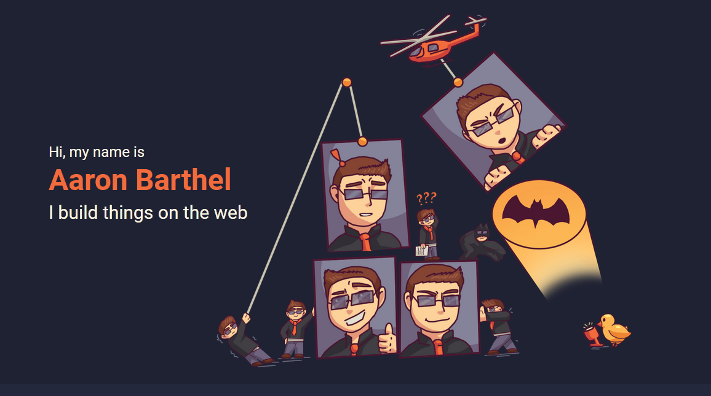

# Milestone 1: Front-End Project
By: Aaron Barthel

* **Trello Board:** [https://trello.com/b/5DBwjVqS/milestone-1-front-end-project](https://trello.com/b/5DBwjVqS/milestone-1-front-end-project)
* **Unique Feature:** The timeline component

This assignment is my resume website. It features a ‘Contact Me’ form along with my objective, work experience, and education.

## Requirements
* Resume is complete
* Objective content is included
* Work Experience content is included
* Education content is includedA
* Resume has a link to your Github account homepage
* All content is spell checked
* All content is grammar checked
* Contact form is complete
  * Form has an input for the sender’s email address or their name
  * Form has an input for the subject of the email
  * Form has an input for the body of the email
  * Form will not allow any of the following ‘swear’ words into the email (fake swear words courtesy of Battlestar Galactica):
    * ["feldercarb", "frack", "skinjob", "vulgacarb"]
    * If the user does enter one of these words then an error message will appear reminding the user that you are a professional and you will not tolerate unprofessional language.
* Website includes a mobile, tablet and desktop layout implemented with a media query
  * CSS is in mobile-first format

* You can add buttons to show/hide sections of your resume based on what the employers want to see. For instance - I could have a series of buttons labelled “Tech”,
“Forestry”, “Odd Jobs”, then on each job item in my resume I could have class = “Tech” or class = “Tech OddJobs” (notice OddJobs is one word now). Then the javascript handler for each button would toggle the visibility of each job item based on the class name. You can research how to make a collapsible as well.

* You can use FontAwesome to add icons for social media websites BUT your social media account must be appropriate to show to potential employers. For instance - I don’t mind employers seeing my Twitter, but I would never let an employer see my Facebook.

* You can add a portfolio page or section to show visual content. You may not be an artist or a photographer, but screenshots of your own applications can be a nice touch for people who are not technologically inclined enough to look at your github. People like Human Resource managers may really appreciate this touch.

## Citation Summary

Summary of citations scattered throught the project.

### CSS
- [Normalise.css](https://github.com/necolas/normalize.css) - Resets default browser styles to allow for more consistency.

### Image Assets
- [Font Awesome 6](https://fontawesome.com/) - Provides various iconography.
- [Ruby Logo](https://seeklogo.com/vector-logo/274466/ruby)
- [Rails Logo](https://seeklogo.com/vector-logo/184637/ruby-on-rails)
- [HTML5 Logo](https://seeklogo.com/vector-logo/184157/html5-without-wordmark-color)
- [Javascript Logo](https://seeklogo.com/vector-logo/273557/javascript-js)
- [C#](https://seeklogo.com/vector-logo/363285/c-sharp-c)
- [Sass](https://seeklogo.com/vector-logo/273879/sass)
- [HAML](https://seeklogo.com/vector-logo/273511/haml)
- [React](https://seeklogo.com/vector-logo/273845/react)
- [Redux](https://seeklogo.com/vector-logo/284335/redux)
- [Vue](https://seeklogo.com/vector-logo/274070/vue-js)
- [Tailwind](https://seeklogo.com/vector-logo/354675/tailwind-css)
- [Bootstrap](https://seeklogo.com/vector-logo/272883/bootstrap)
- [Nodejs](https://seeklogo.com/vector-logo/297890/nodejs)
- [Webpack](https://seeklogo.com/vector-logo/296805/webpack)
- [MySql](https://seeklogo.com/vector-logo/273735/mysql)
- [PostgreSQL](https://www.vectorlogo.zone/util/preview.html?image=/logos/postgresql/postgresql-icon.svg)
- [Redis](https://seeklogo.com/vector-logo/273850/redis)
- [Adobe Illustrator](https://seeklogo.com/vector-logo/158016/adobe-illustrator-cs6)
- [Adobe Photoshop](https://seeklogo.com/vector-logo/268287/adobe-photoshop-cc)
- [Adobe XD](https://seeklogo.com/vector-logo/312271/adobe-xd)

### Special thanks to Kenji

He gave me the idea to to use borders to create my timeline
and then on larger screens to swap to a grid layout
instead of using position absolute/relative.

Without that insight I was ready to abandon the timeline idea.

### Special thanks to Shawna Ray (dyewind)

She provided the amazing illustrations and helped immensely when it came time to
choosing color shades. Her input and influence is felt throughout the design.

### Special thanks to Adamn Wathan and the Tailwind Project

After reading their book Refactoring UI, I use their font / spacing
scales in every design. That alone fixed 80% of my design problems.
